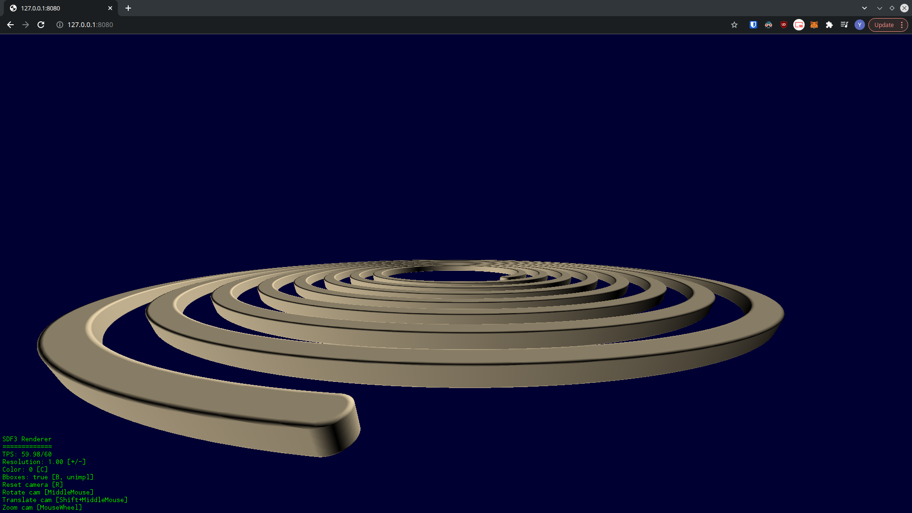
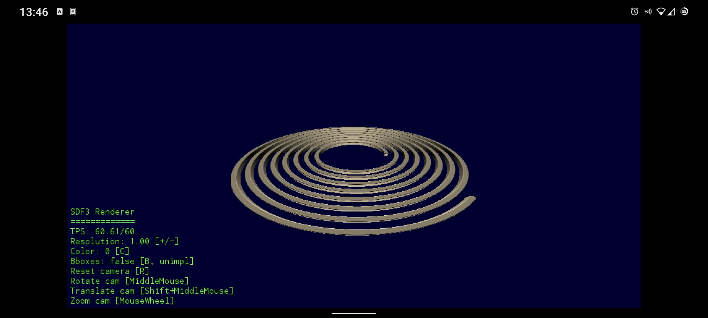

# SDFX-UI


[](https://pkg.go.dev/github.com/Yeicor/sdfx-ui)
[](https://goreportcard.com/report/github.com/Yeicor/sdfx-ui)
[](https://mit-license.org/)

SDFX-UI is a SDF (2D and 3D) renderer intended for fast development iterations that renders directly to a window. It
integrates with your code as a library, meaning that you define your surface and then call the method that starts this
UI.

The UI will listen for code updates (you can use your preferred code editor) and displays the new surfaces automatically
with the same configuration (e.g., camera position).

## Demo

Configuring the Renderer is as simple as [creating your signed distance function](https://github.com/deadsy/sdfx) and
calling `ui.NewRenderer(anySDF).Run()`.

```go
package main

import (
	ui "github.com/Yeicor/sdfx-ui"
	"github.com/deadsy/sdfx/sdf"
)

func main() {
	anySDF, _ := sdf.Box3D(sdf.V3{X: 1, Y: 1, Z: 1}, 0.2)
	_ = ui.NewRenderer(anySDF).Run() // Error handling ignored
}
```

This is a demo of the workflow for designing your own SDF using this UI (code at examples/spiral/main.go):


## How does it work?

The first time you run the code, it starts the renderer process. It also starts listening for code changes. When a code
change is detected, the app is recompiled by the renderer (taking advantage of Go's fast compilation times) and quickly
renders the new surface to the same window (with the same camera position and other settings).

The SDF2 renderer shows the value of the SDF on each pixel using a grayscale: where bright pixels indicate outside the
object and darker pixels are inside. The camera can be moved and scaled (using the mouse), rendering only the
interesting part of the SDF.

SDF3s are raycasted from a perspective arc-ball camera that can be rotated around a pivot point, move its pivot and move
closer or farther away from the pivot (using Blender-like mouse controls). Note that only the shown surface is actually
rendered thanks to raycasting from the camera. This also means that the resulting surface can be much more detailed
(depending on chosen resolution) than the triangle meshes generated by standard mesh generators.

There is an alternative SDF3 renderer (enabled via `ui.Opt3Mesh(...)`) which generates a triangle mesh using an
algorithm from SDFX and then renders that triangle mesh to the screen thanks
to [FauxGL](https://github.com/fogleman/fauxgl). It is a software renderer that is still very fast for our purposes
(faster than the required mesh generation to use it). The main advantage over the raycast renderer is very fast camera
movements and parameter updates, with the disadvantages of low (limited) detail and slower updates (as the initial mesh
generation is slow).

SDFX-UI uses [Ebiten](https://github.com/hajimehoshi/ebiten) for window management and rendering. Ebiten is
cross-platform, so it could also be used to showcase a surface (without automatic updates) creating an application for
desktop, web, mobile or Nintendo Switch™.

### Browser and mobile demos

They use the same code as the demo, see compilation instructions at examples/spiral/main.go.




Note that mobile only works with mouse and keyboard for now (happy to receive pull requests, as Ebiten already supports
touch input).
